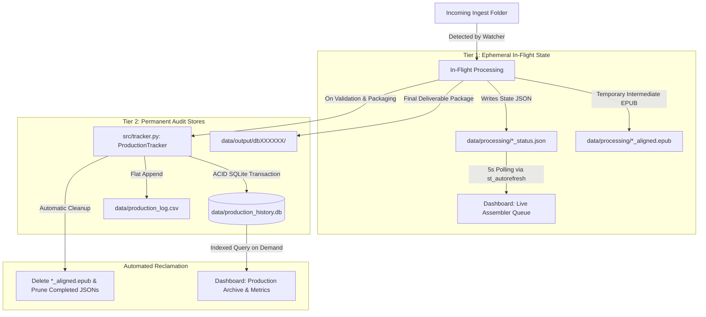

# Data Tracking Architecture & Retention Specification

This document details the production data tracking, audit logging, and storage management architecture for the **Storyteller Assembler** pipeline.

---

## 1. System Overview & Data Flow

The Storyteller Assembler uses a decoupled two-tier data architecture to balance **ultra-fast real-time dashboard responsiveness** with **permanent, queryable compliance and production records**.

---

## 2. Storage & Tracking Tiers

### Tier 1: Ephemeral In-Flight Queue (`data/processing/`)
* **Purpose**: Tracks live job progress (e.g. `aligning`, `processing_dtb`, `validating`) and live elapsed time calculation.
* **Storage Format**: Individual JSON files (`{prod_id}_status.json`).
* **Retention Policy**: 
  * **Active / Failed Jobs**: Retained until manually force-killed, retried, or resolved.
  * **Completed Jobs**: Pruned automatically upon new completions (retaining only the latest ~20 records in the active queue).
  * **Intermediate Heavy Files (`*_aligned.epub`)**: Automatically deleted immediately following successful DTB packaging and validation.

### Tier 2: Permanent Audit & Compliance Archive

#### A. SQLite Production Database (`data/production_history.db`)
* **Engine**: SQLite 3 (Managed via [`src/tracker.py`](file:///Users/carbo/PycharmProjects/auto_story_pipe/src/tracker.py)).
* **Table**: `production_history`
* **Schema**:
  | Column Name | Type | Description |
  | :--- | :--- | :--- |
  | `prod_id` | `TEXT PRIMARY KEY` | Leased Production ID (e.g. `db100018`) |
  | `dc_title` | `TEXT` | Book Title (from OPF metadata) |
  | `dc_creator` | `TEXT` | Author / Creator |
  | `dc_date` | `TEXT` | Publication / Build Date |
  | `dc_publisher` | `TEXT` | Post-processing Distributor (`dc:publisher`) |
  | `source_publisher` | `TEXT` | Original Source Trade Publisher (`dtb:sourcePublisher`) |
  | `dc_language` | `TEXT` | Language Code (e.g. `en-US`) |
  | `x_metadata_narrator` | `TEXT` | Audio Narrator Name |
  | `x_metadata_copyright`| `TEXT` | Copyright notice |
  | `isbn_epub` | `TEXT` | Source EPUB ISBN |
  | `isbn_audio` | `TEXT` | Source Audiobook ISBN |
  | `zedval_status` | `TEXT` | ANSI/NISO Z39.86 ZedVal Status (`pass` / `fail`) |
  | `nlsval_status` | `TEXT` | NLS Specification Validation Status (`pass` / `pending` / `fail`) |
  | `validator_version` | `TEXT` | Executed Validator Suite Version (e.g. `4.07` from `<program appVersion="..."/>`) |
  | `timestamp_completed` | `TEXT` | ISO 8601 Timestamp of completion |

#### B. Human-Readable Audit Export (`data/production_log.csv`)
* **Purpose**: Synchronously appended with identical metadata for direct import into spreadsheets, reporting systems, or business intelligence pipelines.

#### C. Final Deliverables (`data/output/dbXXXXXX/`)
* **Purpose**: Complete ANSI/NISO Z39.86 Digital Talking Book (DTB) packages containing final OPF, NCC/NCX, audio tracks, SMIL files, and compliance logs.

---

## 3. Dashboard Interface Architecture

The **Storyteller Assembler Dashboard** ([`scripts/dashboard.py`](file:///Users/carbo/PycharmProjects/auto_story_pipe/scripts/dashboard.py)) implements three distinct tabs:

### Tab 1: 🚀 Live Assembler Queue
* Polled every 5 seconds via `streamlit-autorefresh` without thread locking or server recursion.
* Displays live progress indicators (`🟢 Completed`, `🟡 Aligning/Packaging`, `🔴 Failed`) and counting-upward elapsed times.
* Features multi-column sorting (Production ID, Title, Status, Elapsed Time, Last Update).
* Includes active container force-kill and `node:slim` cleanup controls.

### Tab 2: 📚 Production Archive
* Directly queries `data/production_history.db` on-demand.
* Features full-text search across Title, Author, Narrator, ISBN, and Production ID.
* Provides a **Compliance Filter** (`All Records`, `Passed`, `Failed`).
* Includes a one-click **📥 Export Full CSV Log** button.
* Offers a manual **🧹 Prune Completed In-Flight Files** action to reclaim disk space without touching persistent history.

### Tab 3: 📊 Analytics & Audit
* Real-time metrics overview:
  * Total Books Produced
  * ZedVal Compliance Pass Rate (%)
  * Count of Distinct Narrators & Publishers
* Summary breakdown of the 10 most recent production runs.

---

## 4. Maintenance & Data Integrity

1. **Storage Safety**: Pruning operations strictly target ephemeral `data/processing/*_status.json` and intermediate `.epub` files. The SQLite database (`data/production_history.db`) and CSV log (`data/production_log.csv`) are never deleted or truncated during routine pruning.
2. **Crash Resilience**: If the watcher daemon or dashboard restarts unexpectedly, in-flight status JSONs provide an immediate snapshot of the last active state, while `production_history.db` preserves all committed records.
