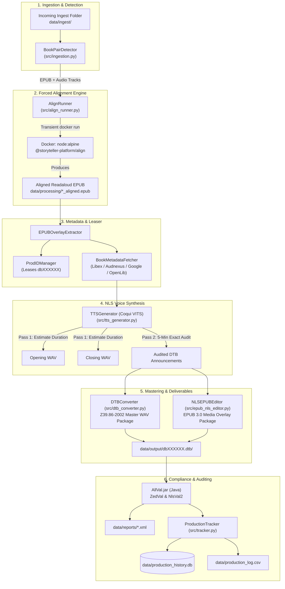
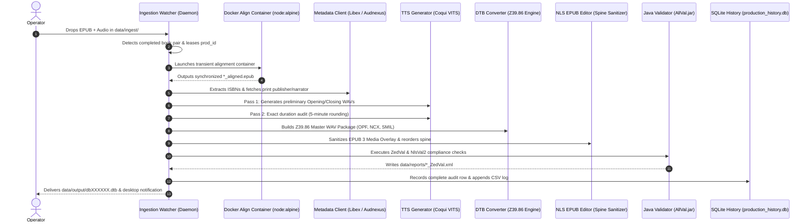

# Storyteller Assembler (`auto_story_pipe`)

[](https://www.python.org/downloads/)
[](http://www.daisy.org/z3986/2005/Z3986-2005.html)
[](https://www.w3.org/publishing/epub3/epub-mediaoverlays.html)
[](https://www.loc.gov/nls/)
[](https://hub.docker.com/_/node)

An automated, end-to-end production pipeline and mastering suite for **National Library Service (NLS) Digital Talking Books (DTB)** and synchronized **EPUB 3.0 Media Overlay audiobooks**.

`auto_story_pipe` ingests raw book pairs (source trade EPUBs and audiobook narration), performs forced audio-text alignment using a zero-overhead transient container, enriches publication metadata from online ISBN databases, synthesizes standardized NLS opening and closing announcements with exact reading duration convergence via Neural TTS, packages compliant ANSI/NISO Z39.86 DTB deliverables, and performs automated Java compliance verification (`ZedVal` / `NlsVal2`).

---

## Table of Contents

- [Overview](#overview)
- [Key Features](#key-features)
- [Architecture & System Workflow](#architecture--system-workflow)
- [System Requirements & Prerequisites](#system-requirements--prerequisites)
- [Installation & Setup](#installation--setup)
- [Directory Layout & Workspace Hierarchy](#directory-layout--workspace-hierarchy)
- [Execution Modes & User Guide](#execution-modes--user-guide)
  - [1. Graphical Web Dashboard (Recommended for Day-to-Day Operations)](#1-graphical-web-dashboard-recommended-for-day-to-day-operations)
  - [2. Headless Ingestion Watcher Daemon (Automated Ingest)](#2-headless-ingestion-watcher-daemon-automated-ingest)
  - [3. Direct Testing & Validation Tool (`test_post_storyteller.py`)](#3-direct-testing--validation-tool-test_post_storytellerpy)
  - [4. TTS Script & Pronunciation Sandbox (`tts_sandbox.py`)](#4-tts-script--pronunciation-sandbox-tts_sandboxpy)
- [Processing Pipeline Breakdown](#processing-pipeline-breakdown)
  - [Stage 1: Pair Detection & Ingestion](#stage-1-pair-detection--ingestion)
  - [Stage 2: Containerized Forced Alignment](#stage-2-containerized-forced-alignment)
  - [Stage 3: Metadata Enrichment & ID Leasing](#stage-3-metadata-enrichment--id-leasing)
  - [Stage 4: Automated NLS Announcement Generation (Neural TTS)](#stage-4-automated-nls-announcement-generation-neural-tts)
  - [Stage 5: Master DTB & EPUB 3 Media Overlay Packaging](#stage-5-master-dtb--epub-3-media-overlay-packaging)
  - [Stage 6: Automated Java Compliance Verification](#stage-6-automated-java-compliance-verification)
  - [Stage 7: Audit Tracking & Telemetry](#stage-7-audit-tracking--telemetry)
- [Data Storage & Zero-State Database Portability](#data-storage--zero-state-database-portability)
- [Compliance & Standards](#compliance--standards)
- [Troubleshooting & FAQs](#troubleshooting--faqs)
- [License & Attribution](#license--attribution)

---

## Overview

Producing distribution-ready NLS Digital Talking Books (DTB) and accessible readaloud EPUBs requires coordinating multiple complex technical steps:
1. Matching unstructured EPUB files with raw multi-track audiobook audio (`.mp3`, `.m4b`, `.flac`, `.opus`, `.wav`).
2. Performing word-level and sentence-level forced alignment between the XHTML text nodes and audio streams.
3. Querying authoritative metadata sources (ISBN, narrator, print publisher, recording agency, copyright).
4. Generating formal NLS Opening and Closing audio announcements with spelled-out author names and strictly rounded reading times (rounded to the nearest 5 minutes per NLS Section 4.1).
5. Transforming and structuring XML/SMIL markup with strict DTD validation (`ANSI/NISO Z39.86-2002`).
6. Enforcing linear spine ordering for EPUB 3 Media Overlay manifests and metadata (`epub_MED_015` compliance).
7. Verifying complete package compliance via official NLS Java validators (`AllVal.jar` / `ZedVal` / `NlsVal2`).

`auto_story_pipe` provides a unified engine that runs locally on macOS, Linux, or Windows, orchestrating the entire lifecycle from incoming dropped files to final audited deliverable packages.

---

## Key Features

- **Automated Drop-Folder Ingestion**: Actively monitors `data/ingest/` for new book folders containing an EPUB and matching audio files.
- **Transient Containerized Alignment**: Leverages official `node:alpine` Docker images to run `@storyteller-platform/align` on-demand with zero resident memory overhead and no requirement for host Node.js.
- **Neural TTS NLS Announcements**: Integrated Coqui TTS / VITS engine synthesizes natural spoken opening and closing credits, complete with NATO/phonetic spelling of author names and dynamic total reading time calculations.
- **Two-Pass Convergence Algorithm**: Automatically recalculates total program duration after rendering announcements to guarantee exact 5-minute rounding accuracy.
- **Multi-Source ISBN Metadata Enrichment**: Automatically queries Libex, Audnexus, Google Books, and Open Library APIs to retrieve missing publisher, narrator, and genre information.
- **Thread-Safe Sequential Production ID Leasing**: Centralized ID leaser manages prefix and 6-digit ranges (e.g. `db100038`) across concurrent or sequential runs.
- **Dual Compliance Deliverables**: Generates both an ANSI/NISO Z39.86 DTB master package (`<prod_id>.dtb/`) and a synchronized, spine-ordered EPUB 3.0 Media Overlay package (`<prod_id>.epub`).
- **Automated Validation Integration**: Direct execution of NLS `AllVal.jar` (`ZedVal` & `NlsVal2`) with structured XML/log report generation.
- **Two-Tier Storage & Dashboard**: Ephemeral in-flight queue coupled with an ACID SQLite production archive (`data/production_history.db`) and CSV audit log (`data/production_log.csv`).
- **Native User Interfaces**: Rich Streamlit web dashboard with macOS desktop notifications, plus a one-click macOS double-clickable launcher (`launch_dashboard.command`).

---

## Architecture & System Workflow



---

## System Requirements & Prerequisites

- **Operating System**: macOS 12+ (Apple Silicon or Intel), Linux (Ubuntu 20.04+, Debian 11+), or Windows 10/11 (WSL2 recommended).
- **Python**: Python `3.9` through `3.11` (Python 3.9.6+ tested).
- **Docker Engine**: Docker Desktop or Docker Engine running locally. Used to execute transient alignment containers.
- **Java Runtime Environment (JRE)**: Java 8 or higher required on system `PATH` for `AllVal.jar` compliance validation.
- **Audio & TTS Libraries**:
  - `ffmpeg`: Required for audio transcoding and slicing.
  - `espeak-ng`: Required system library for phonetic transcription in Coqui TTS.
- **NLS Validator Suite**: `AllVal.jar` (optional for local compliance verification).

---

## Installation & Setup

### 1. Clone the Repository
```bash
git clone git@github.com:pcarbo23/storyteller-assembler.git
cd storyteller-assembler
```

### 2. Create and Activate Virtual Environment
```bash
python3 -m venv .venv
source .venv/bin/activate  # On Windows: .venv\Scripts\activate
```

### 3. Install System Dependencies
- **macOS (Homebrew)**:
  ```bash
  brew install ffmpeg espeak-ng openjdk
  ```
- **Ubuntu / Debian**:
  ```bash
  sudo apt-get update && sudo apt-get install -y ffmpeg espeak-ng default-jre
  ```

### 4. Install Python Dependencies
```bash
pip install --upgrade pip
pip install -r requirements.txt
```

### 5. Configure Environment Variables
Copy the sample environment file:
```bash
cp .env.example .env
```
*(Default settings use local disk storage in `./data/` and standard Coqui VITS voice models).*

---

## Directory Layout & Workspace Hierarchy

The repository uses a clear separation between code, configuration, and data tiers:

```text
storyteller-assembler/
├── config/
│   └── production_config.json   # Production ID range & prefix leaser state
├── data/                        # Local runtime data root (Excluded from Git)
│   ├── debug/                   # Forensic diagnostics & error capture logs
│   ├── ingest/                  # Incoming drop-folder for unaligned book sets
│   ├── output/                  # Final Master DTB deliverables (dbXXXXXX.dtb/)
│   ├── processing/              # Ephemeral in-flight status JSONs & work files
│   ├── reports/                 # ZedVal & NlsVal2 XML validation logs
│   ├── production_history.db    # ACID SQLite audit store (Auto-initialized)
│   └── production_log.csv       # Flat CSV production history log
├── design_docs/                 # Architecture, standards, and requirements specifications
├── launch_dashboard.command     # macOS double-clickable launcher script
├── requirements.txt             # Python package dependencies
├── scripts/
│   ├── dashboard.py             # Streamlit web GUI dashboard application
│   ├── run_ingest_watcher.py    # Background Ingestion Watcher daemon
│   ├── test_post_storyteller.py # Post-alignment standalone test & validation tool
│   ├── generate_tts_audio.py    # Subprocess TTS audio generation worker
│   ├── debug_e2e_tracker.py     # Passive telemetry & forensic tracker
│   └── tts_sandbox.py           # Pronunciation, spelling & timing test sandbox
├── src/
│   ├── align_runner.py          # Transient Docker aligner runner
│   ├── dtb_converter.py         # Z39.86-2002 OPF, NCX, SMIL, & WAV packager
│   ├── epub_nls_editor.py       # EPUB 3 Media Overlay NLS metadata & spine sanitizer
│   ├── epub_upgrader.py         # EPUB 2.0 to EPUB 3.0 upgrader & nav builder
│   ├── external/
│   │   └── metadata_client.py   # Multi-source ISBN metadata client (Libex/Audnexus)
│   ├── ingestion.py             # Book pair detection & directory scanning
│   ├── main.py                  # End-to-end processing pipeline entrypoint
│   ├── prod_id_manager.py       # Thread-safe sequential ID leaser
│   ├── resources/               # Official DTD and ENT schema definitions
│   ├── tracker.py               # SQLite & CSV audit tracker
│   └── tts_generator.py         # Coqui TTS engine & announcement script builder
└── tests/                       # Pytest automated test suite
```

---

## Execution Modes & User Guide

### 1. Graphical Web Dashboard (Recommended for Day-to-Day Operations)

The **Streamlit Web Dashboard** provides a user-friendly interface designed for both non-technical operators and production staff.

```text
+-----------------------------------------------------------------------------------------+
|  📚 STORYTELLER ASSEMBLER DASHBOARD                           🟢 Docker Ready  🟢 Watcher Active |
+-----------------------------------------------------------------------------------------+
|  [Tab 1: 🚀 Live Queue]     [Tab 2: 📚 Production Archive]     [Tab 3: 📊 Analytics]     |
|                                                                                         |
|  Current In-Flight Jobs:                                                                |
|  • db100038 | "A Mouthful of Dust" | 🟡 Aligning Audio/Text | 04:12 elapsed              |
|                                                                                         |
|  Watcher Controls: [ ⏹ Stop Ingestion Watcher ]   [ 🔄 Refresh Queue ]                    |
+-----------------------------------------------------------------------------------------+
```

#### How to Launch:
- **On macOS (One-Click)**: Double-click `launch_dashboard.command` from Finder.
- **Via Terminal (Any Platform)**:
  ```bash
  source .venv/bin/activate
  streamlit run scripts/dashboard.py
  ```

#### How to Use:
1. **Drop Book Files**: Copy your book folder (containing one `.epub` and matching audio files) into `data/ingest/`.
2. **Monitor In-Flight Progress**: In **Tab 1 (Live Queue)**, observe real-time status updates (`🟡 Aligning`, `🟡 Packaging DTB`, `🟡 Validating`, `🟢 Completed`) and counting elapsed timers.
3. **Inspect Completed Productions**: In **Tab 2 (Production Archive)**, search books by Title, Author, Narrator, or ID, review ZedVal validation results, and click **📥 Export Full CSV Log**.
4. **Daemon Control**: Start or stop the Ingestion Watcher daemon directly using the GUI buttons in the dashboard header.

---

### 2. Headless Ingestion Watcher Daemon (Automated Ingest)

For automated server deployments, command-line environments, or background batch processing, the watcher daemon can be run independently of the web GUI.

#### How to Launch:
```bash
source .venv/bin/activate
python scripts/run_ingest_watcher.py
```

#### How It Works:
1. The daemon starts, verifies Docker and Python environments, and begins polling `data/ingest/`.
2. Whenever a new folder containing an EPUB and audio tracks is detected, the daemon automatically:
   - Leases the next sequential Production ID (e.g., `db100038`).
   - Launches a transient `node:alpine` container to perform forced alignment.
   - Synthesizes opening/closing announcements with exact duration convergence.
   - Master-packages the ANSI/NISO Z39.86 DTB and NLS EPUB 3 files into `data/output/`.
   - Runs `ZedVal` and `NlsVal2` compliance validation.
   - Commits records to `data/production_history.db` and dispatches native desktop notifications.

---

### 3. Direct Testing & Validation Tool (`test_post_storyteller.py`)

#### Use Case:
When you already have a **pre-aligned readaloud EPUB** (for instance, exported from an external Storyteller instance or alignment tool) and need to verify compliance or package it directly without re-running alignment.

#### How to Run:
```bash
source .venv/bin/activate
python scripts/test_post_storyteller.py "/path/to/aligned_book (readaloud).epub" --prod-id 100001
```

#### CLI Options:
| Argument / Option | Default | Description |
| :--- | :--- | :--- |
| `epub_path` *(Positional)* | *Required* | Path to the aligned EPUB 3 Media Overlay file. |
| `--prod-id` | `100001` | Specific 5-digit or 6-digit production ID to assign. |
| `--output-dir` | `data/output` | Destination directory for the generated master DTB folder. |
| `--work-dir` | `data/processing` | Intermediate working directory. |
| `--validator-jar` | `test_material/AllVal.jar` | Path to `AllVal.jar` for immediate ZedVal/NlsVal2 verification. |

---

### 4. TTS Script & Pronunciation Sandbox (`tts_sandbox.py`)

#### Use Case:
Use the TTS Sandbox to test and preview how book metadata (author spelling, narrator attribution, publication dates, and reading hours) will sound before running full productions.

#### How to Run:
```bash
source .venv/bin/activate
python scripts/tts_sandbox.py
```

---

## Processing Pipeline Breakdown



### Stage 1: Pair Detection & Ingestion
`src/ingestion.py` scans `data/ingest/` for directories containing exactly one EPUB and corresponding narration files (`.mp3`, `.m4b`, `.wav`, `.flac`, `.opus`).

### Stage 2: Containerized Forced Alignment
`src/align_runner.py` executes `@storyteller-platform/align` inside a clean `node:alpine` Docker container. The container processes the audio against XHTML text nodes, generates SMIL sync maps, and terminates immediately upon completion.

### Stage 3: Metadata Enrichment & ID Leasing
`src/prod_id_manager.py` leases a sequential production ID (e.g. `db100038`). `src/external/metadata_client.py` extracts ISBNs from filenames and OPF metadata, performing consolidated queries against Libex, Audnexus, Google Books, and Open Library to retrieve complete bibliographic metadata.

### Stage 4: Automated NLS Announcement Generation (Neural TTS)
`src/tts_generator.py` formats required NLS announcements (Section 4.1 & 4.2):
- Spells out author names phonetically (e.g., *"By John Steinbeck, J. O. H. N. ... S. T. E. I. N. B. E. C. K."*).
- Applies a **Two-Pass Convergence Algorithm**: Pass 1 synthesizes preliminary audio to calculate initial duration; Pass 2 measures exact millisecond audio lengths and verifies whether the rounded 5-minute announcement requires re-synthesis.

### Stage 5: Master DTB & EPUB 3 Media Overlay Packaging
- `src/dtb_converter.py` transcodes all audio to master 44.1kHz WAV, generating ANSI/NISO Z39.86-2002 compliant OPF, NCX, and SMIL files.
- `src/epub_nls_editor.py` ensures the parallel EPUB 3 Media Overlay package meets strict NLS requirements:
  - Preserves original source UID while refining with `nls-id` (`us-nls-dbXXXXXX`).
  - Strict reordering of `<manifest>` SMIL entries and `media:duration` `<meta>` elements to exactly match the reading order defined in the `<spine>` (`epub_MED_015` compliance).

### Stage 6: Automated Java Compliance Verification
The pipeline executes `AllVal.jar` (`ZedVal` and `NlsVal2`) against the output package, capturing detailed error logs and XML test results in `data/reports/`.

### Stage 7: Audit Tracking & Telemetry
`src/tracker.py` commits the full run metadata, validator versions, and compliance status to SQLite and CSV.

---

## Data Storage & Zero-State Database Portability

The pipeline is designed with a **zero-state architecture**:
1. **No Proprietary Data in Git**: All databases (`*.db`), logs (`*.log`), in-flight JSONs, test books, and output packages are ignored via `.gitignore`.
2. **Auto-Initialization on Fresh Clone**:
   - When cloned onto a new machine, running either the Ingestion Watcher or the Streamlit Dashboard will automatically create `data/production_history.db` with all required tables and schema migrations on the first run.
   - Folder structure placeholders (`.gitkeep`) ensure all expected folders (`data/ingest/`, `data/processing/`, `data/output/`, `data/reports/`) exist immediately after `git clone`.

---

## Compliance & Standards

| Standard / Specification | Application in Storyteller Assembler |
| :--- | :--- |
| **ANSI/NISO Z39.86-2002** | Master Talking Book specifications, XML DOCTYPEs, NCX navigation maps, and SMIL 1.0 synchronization. |
| **EPUB 3.0.1 / 3.2 Media Overlays** | W3C / IDPF Media Overlay synchronizations, spine-ordered manifest items, and `-epub-media-overlay-active` styling. |
| **NLS Specification 1202** | NLS Talking Book structure, announcements, author spelling conventions, and reading duration rounding rules. |
| **NLS Specification 1203** | Manifest file integrity and cryptographic MD5 digest calculations. |
| **NLS Specification 1206** | Package structure and distribution deliverables. |

---

## Troubleshooting & FAQs

### 1. Docker Daemon Not Running
> **Error**: `docker: Cannot connect to the Docker daemon at unix:///var/run/docker.sock.`

**Resolution**: Ensure Docker Desktop (or the Docker daemon on Linux) is started and running before launching the watcher or dashboard.

### 2. Missing Java JRE / ZedVal Validation Skipped
> **Log**: `Java executable could not be found via JAVA_HOME or system PATH. Skipping ZedVal.`

**Resolution**: Install a Java Runtime Environment (JRE 8+) and verify that typing `java -version` in your terminal outputs a valid version string.

### 3. Coqui TTS / PyTorch Audio Dependency Errors
> **Error**: `RuntimeError: espeak not installed on system.`

**Resolution**:
- On macOS: `brew install espeak-ng`
- On Ubuntu/Debian: `sudo apt-get install espeak-ng`

### 4. Adjusting Production ID Ranges
Production IDs are configured in `config/production_config.json`:
```json
{
  "prefix": "db",
  "range_start": 100000,
  "range_end": 999999,
  "next_value": 100000
}
```
You can edit `next_value` to advance or reset the next leased ID number.

---

## License & Attribution

Developed for the **National Library Service for the Blind and Print Disabled (NLS)**, Library of Congress.
